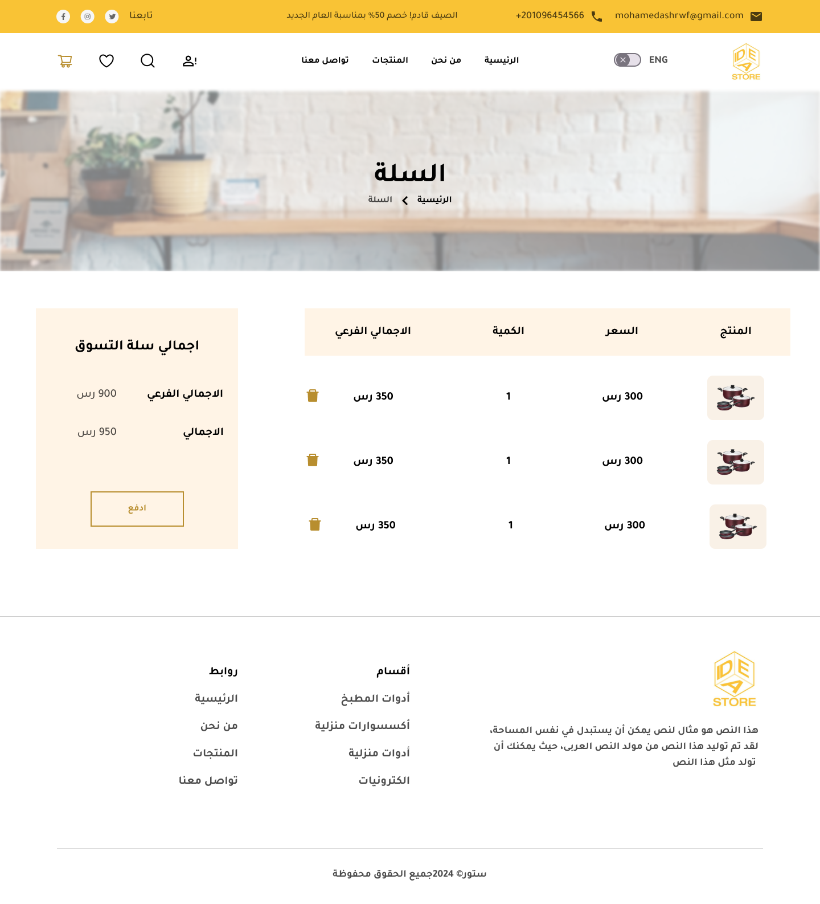

# E-Store E-Commerce Frontend

A scalable and feature-rich e-commerce frontend built using  Angular. This application integrates with a backend API to provide a seamless online shopping experience, offering features like product browsing, cart management, user authentication, and more.

## ✨ Features


### User-Focused Features:
- **User Authentication & Security**: Secure registration, login, and password recovery, with JWT-based authentication via external API.
- **Product Browsing & Advanced Search**: Explore products by category and subcategory with powerful search, filtering, and sorting options (price, rating, etc.).
- **Pagination Support**: Paginated product lists for efficient browsing.
- **Shopping Cart & Wishlist**: Add, update, and remove products from the cart with dynamic cost calculation. Manage your wishlist for favorite items.


- **Coupon Support**: Apply discount coupons during checkout.
- **Order Processing**: Review orders before finalizing and view order summaries.
- **User Profile Management**: View and edit profile details such as name, phone number, and other personal information.


### Admin Features:
- **Category & Product Management**: Full CRUD operations for categories, subcategories, and products (through the external API).
- **Order Management**: Admin interface for viewing and managing customer orders (via external API).


## 🛠️ Technologies Used
- **Angular**: For building a dynamic, single-page application with reactive forms and components.
- **API Integration**: Seamless connection to an external API for all back-end operations.
- **JWT Authentication**: For secure user authentication and session handling with the external API.
- **TypeScript**: For ensuring type safety and scalable code.

## ⚙️ Key Functionalities

### Authentication & Authorization:
- Secure login and registration using JWT with API integration.
- Password reset functionality.

### Product & Category Management:
- Fetch and manage products and categories from the external API.
- Admin CRUD operations for categories and products.

### Shopping Cart & Orders:
- Dynamic cart management with total price calculations.
- Apply coupons and track discounts during checkout.
- Complete order placement and tracking through the external API.

### Profile Management:
- **Profile Page**: Users can view and edit their personal information (name, phone, etc.) through a profile page.
- Data is fetched from the external API and can be updated, ensuring smooth user data management.


## 📦 Installation
1. Clone the repository:
   ```bash
   git clone https://github.com/Mostafa7ahmed/full-stack-E-commerce
   cd full-stack-E-commerce
